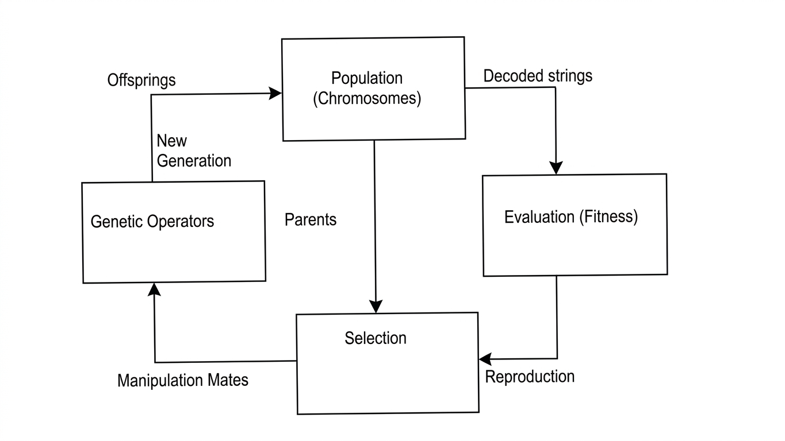
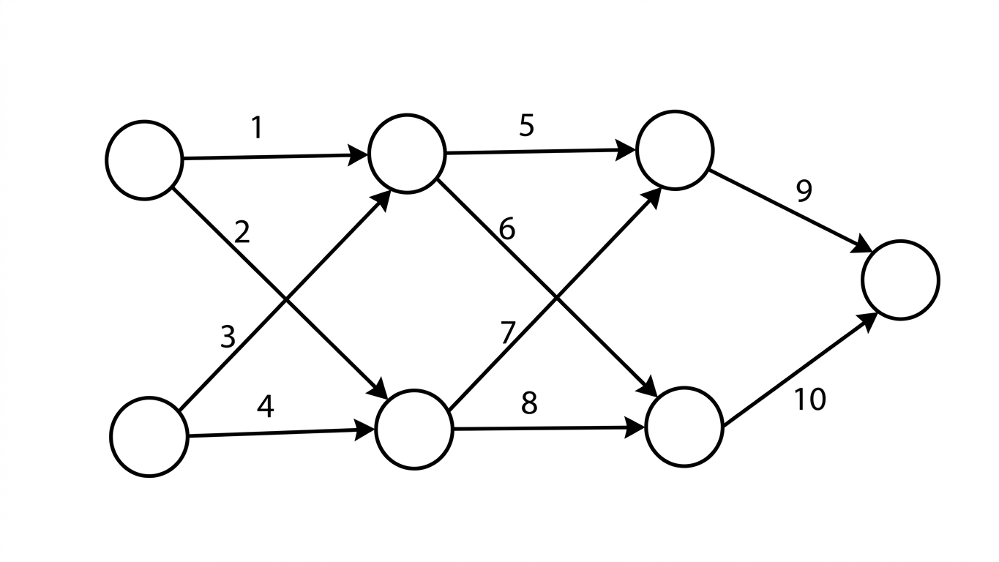
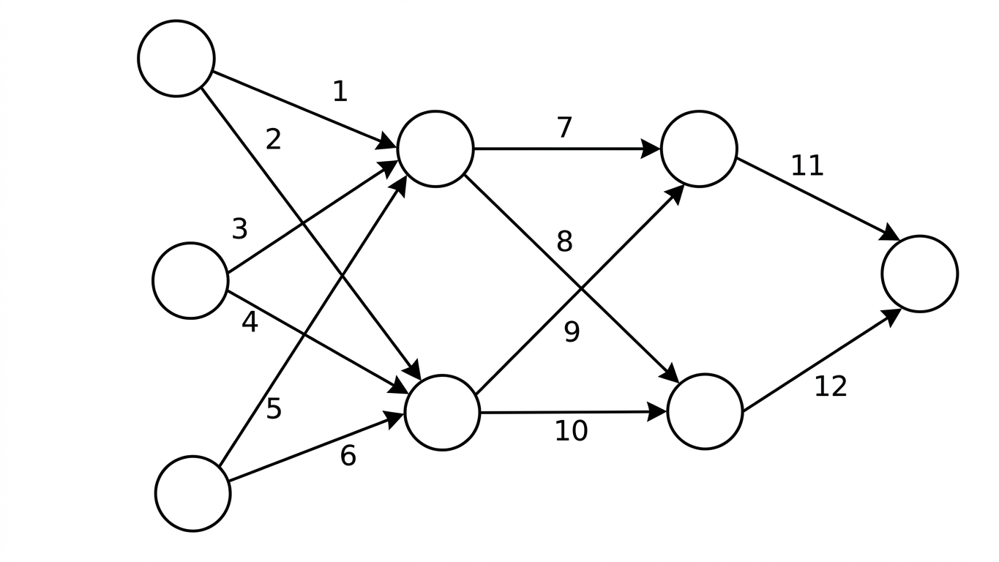
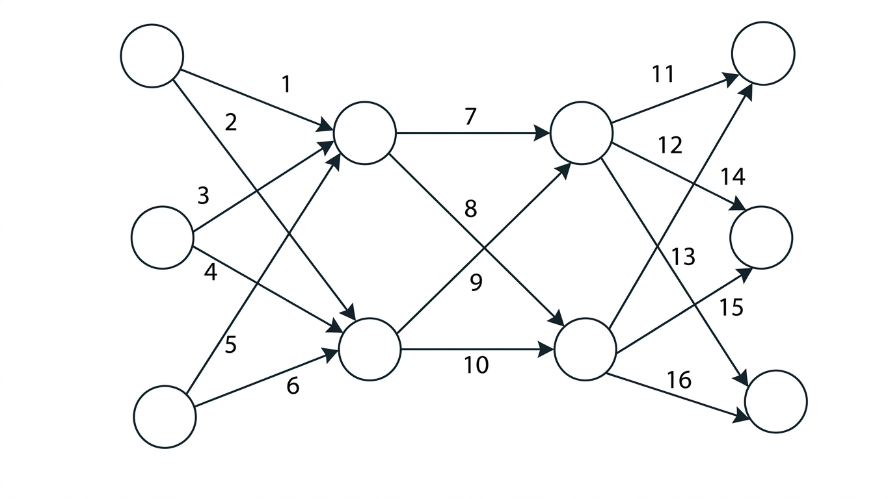
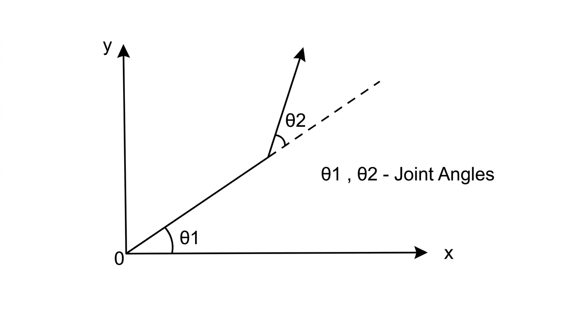
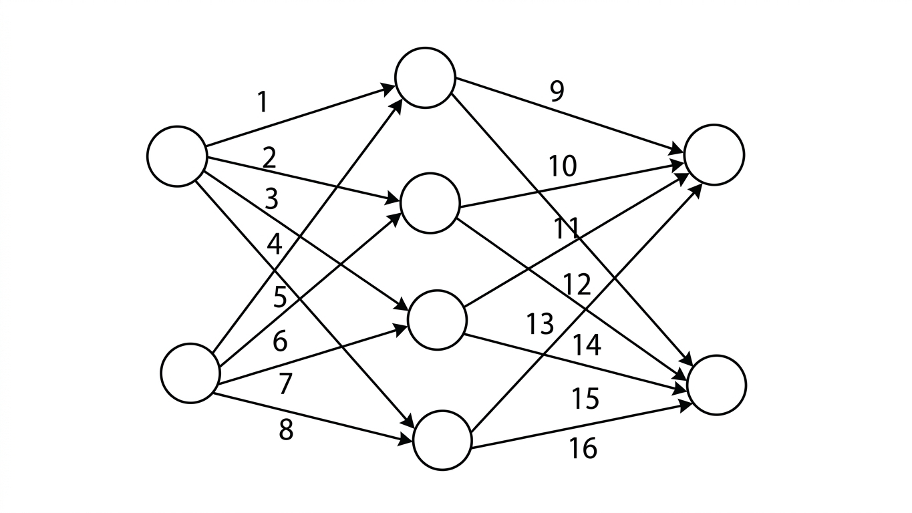
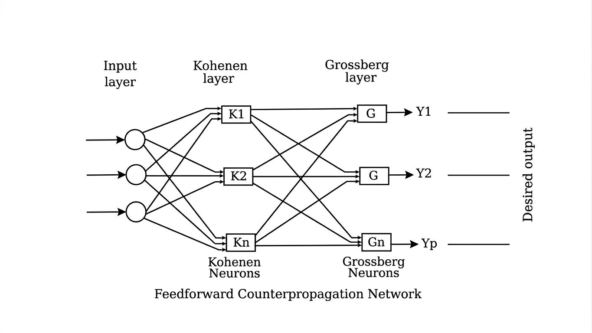

---
# ------------------------------------------------------------------
# Book Identity
# ------------------------------------------------------------------

title: ANALYSIS OF ARTIFICIAL NEURAL NETWORK
subtitle: USING BACK PROPAGATION & GENETIC ALGORITHM
author:
  - RAVI KUMAR V.T.R.
  - KUMARESAN U
  - RAGUPATHI KUMAR D.


# ------------------------------------------------------------------
# Publication
# ------------------------------------------------------------------

edition: Reading Draft
version: v1.0
copyright_year: November 1998

publisher:
  name:
    - DEPARTMENT OF COMPUTER SCIENCE AND ENGINEERING
    - J.J. COLLEGE OF ENGINEERING AND TECHNOLOGY
    - (Affiliated to the Bharathidasan University)
    - THIRUCHIRAPPALLI - 620 009
  logo: college-logo.png
# ------------------------------------------------------------------
# Layout
# ------------------------------------------------------------------

type: technical-document
language: en
---
# ANALYSIS OF ARTIFICIAL NEURAL NETWORK

## VIVA VOCE EXAMINATION


The Viva Voce Examination of the Project work done by RAVI KUMAR V.I.R. E 451640 (Reg. No) in partial fulfillment of the requirements for the B.E degree in COMPUTER SCIENCE & ENGINEERING was held on 13 OCTOBER'98 


INTERNAL EXAMINER


EXTERNAL EXAMINER

## CERTIFICATE


This is to certify that the project titled "Analysis of Artificial Neural Network" is a bonofide work done by RAVI KUMAR V.T.R. Reg.No E451640 in partial fulfillment of the requirement for the award of the degree of Bachelor of Engineering in Computer Science and Engineering during 1994-1998. 


PROJECT GUIDE


HEAD OF THE DEPARTMENT 

## Acknowledgement


We are thankful to our Director Dr. V. Shanmuganathan for giving excellent opportunity for taking up the course and providing a conducive environment to finish our project successfully.

We extend our sincere thanks to Prof. S. Ramakrishnan.(System Manager & Head Of CSE Dept.) for his guidance and suggestions towards the improvement of our project. 

We have immense pleasure in thanking our guide Miss.Shameem Fathima and our guide Mr. R.Balasubramanian under whose guidance the project has been shaped in a very successful manner. 

Last but not the least we would like to thank the Technical support group of our Brainland Computer Centre for providing all that we needed and staying late in the night for us. 

Above all, I express my gratitude to my beloved parents for shaping me as an Engineer.

## Abstract


The aim of the project is to implement a system based on Genetic algorithm with enhanced encoding. The system is used to evolve forward Artificial Neural Network which has been applied to problem areas of boolean functions. 

Evolving Neural Network means that optimizing of the connection and connectivity of the Neural Network. Although many techniques like Back Propagation learning exists, a new approach using Genetic Algorithm has been tried in this work

Genetic Algorithm is randomized search technique that is domain free, robust and has a fast rate of convergence. Genetic Algorithm search methods are rooted in the mechanism of evolution and natural genetics. They combine survival of the fittest among string randomized information exchange to form search algorithm with some of the innovative flairs of human search.

In this project we compare the efficiency of Genetic Algorithm and Back Propagation Algorithm and observe that Genetic Algorithm are efficient and robust optimization tools which outperform their counterpart.

## INTRODUCTION

### GENERAL

Artificial Neural Net models have been studied for many years on the hope of achieving human-like performance in various fields to find number of real world applications. These models are composed of many non - linear computational elements operating in parallel and arranged in patterns reminiscent of biological neural nets. Computational elements or nodes are connected by weights that are typically adapted during use to improve performance. There has been a recent resurgence in the field of Artificial Neural Networks caused by new net topologies, algorithms and analog VLSI implementation techniques. 

Standard techniques exist for training Neural Networks. But there is still a need for better and efficient techniques to train Neural Networks. 

In the proposed project, this problem has been modelled as an optimization problem and novell approach called *GENETIC ALGORITHM* has been adopted to solve it.

### STATE OF THE ART

Currently there are various classical optimization techniques. 

Calculus based methods use a set of necessary and sufficient conditions to be satisfied by the solution of an optimization problem. This method can be further divided into Direct and Indirect methods. These techniques can be used only in a restricted set of well. behaved problem. 

Enumerated techniques search every point related to an objective function's domain space one point at a time. They are simple to implement but may required significant computation. 

Guided random search techniques are based on enumeration techniques but use additional information to guide the search They can solve very complete problems. The major sub classes are Simulated Annealing and Evolutionary Algorithms. Both are evolutionary processes. But Simulated Annealing on the other hand are based on natural selection principles. This form of search evolves throughout generations, improving the features of potential solutions by means of biologically inspired operations . This in turn subdivided into Evolutionary Strategies and Genetic Algorithms.

GAs came into existence as a result of doctoral dissertation of Dr.John Holland of university of Michigan, Ann Arbor. Ever since it gained immense popularity and prominence and have been applied to a number of areas .A lot of research work have been carried out throughout the world .David E. Goldberg, prof, General Engineering, University of Illinois at Urbana-campaign, has been a forerunner of research in GA and has produced one of the widely referenced text on GA .Dr. Kenneth De jong of george Mason University has proposed a test suite that attempts to formalize the concepts behind the working of GA.

### MOTIVATION OF THE PROJECT

The field of Genetic Algorithm is new and evolving. It has a wide variety of application. 

One of the major problem in constructing any Neural Network is fixing the inter neuron weight in real - time .Genetic algorithm to be a useful integration, when not a viable alternative to more common algorithm such as Back propagation .So these stood as a cause of motivation to pursue this project.

### SCOPE OF THE PROJECT

Artificial Neural Network have a spectrum of practical application in various fields. The work of this project can be applied for determining the optimal network for any such application.

## PROBLEM DEFINITION AND METHODOLOGY

### PROBLEM DEFINITION

The aim of the project is to implement a system based on Genetic algorithm with enhanced encoding. The system is used to evolve feed forward. Artificial Neural Network which has been applied to problem areas of boolean function learning and Robot arm movement.

### METHODOLOGY

A Generic algorithm emulates biological evolutionary theories to solve optimization problems .A GA consist of set individual elements ( the population) and a set of biologically inspired operators defined over the population itself. According to evolutionary theories, only the most suited elements in a population are likely to survive and generates offspring , thus transmitting their biological heredity to new generations. In computing terms, a GA maps a problem onto a set of (typically binary)strings, each string representing a potential solution. The GA that manipulates the most promising strings in its search for improved solution. Thus this concept is applied to a Neural Network design it as an optimization problem. 

First an initial set of individuals are generated, each representing a concatenated string of weights of the links of a neural network. Tine each string is evaluated for a fitness solution using the objective function of calculating the mean squared error by feed forwarding on the network.

As per the GA the fitter string i.e., one with aless error will be eligible for survival and the strings of lesser fitness are omitted from going to next generation. The GA operations like reproduction, crossover, mutation etc. are applied in every generation and this process is repeated for a fixed number of generation or until a fittest solution is evaluated. The string with optimal fitness value will be taken as final concatenated weight of the links

## EVOLUTIONARY DESIGN CONCEPTS

### INTRODUCTION

Technology periodically steals a leaf from nature's book Evolutionary design paradigm is one such example. This paradigm is focused on Genetic Algorithm to explore its advantage over conventional algorithms while learning neural networks.

### GENETIC ALGORITHM

Genetic Algorithm are essentially robust search algorithm based on the mechanics of natural selection and natural genetics. They are best suited for problems having comparatively larger solution spaces. They use randomized information exchange between solutions to obtain an optimal solution. 

Genetic Algorithms start with a finite set of solution strings called the initial population and then apply the operators, 

- Reproduction, 
- Crossover & 
- Mutation 

These operators are applied repeatedly thereby guiding the search towards better and better solutions. The power of GA stands in its ability to exploit historical information to improve future performance. Moreover the algorithm conducts a parallel search by sampling various parts of the hyperplane of solution at the same time.

#### ALGORITHM INTERNALS

I.GO GAs work by maintaining a population of candidate solutions to a given problem.. Each solution is stored as an artificial chromosome, represented by a string of bits,integers or characters(usually represented by bits). An initial population of solution is created randomly. Only a fixed number of candidate solutions are transferred from one generation to the next. Those solutions that are less fit tend to die off( this is done by selection operation to be discussed later). Successively new solutions are created by building on the better solution previously encountered( this is done using crossover and mutation operators explained later) thereby inducing the search to become successively concentrated in areas of current optima.

#### TERMINOLOGIES USED

Many biological terms are used in the Genetic Algorithm literature. The pool of solutions is often called the "population", individual strings in the pool are "chromosome", individual features are "genes" and the value of the feature in a particular solution is "allele". 

Example: In a particular problem, a variable x to be optimized is evolved using 4-bit encoded string. The illustration of strings during some intermediate step is shown in the table 

      | x1 | x2 | x3 | x4 |
      |:---:|:---:|:---:|:---:|
      | 0 | 0 | 0 | 0 |
      | 0 | 0 | 0 | 1 |
      | 1 | 0 | 0 | 1 |
      | 1 | 1 | 1 | 0 |


#### THE ALGORITHM


##### PSEUDOCODE

The Genetic Algorithm pseudo code is given as.
```c
        Initialize population POP[0]
        Evaluate population POP[0]
        Generation = 1
        While termination criterion not reached
        {
          Select solutions for POP[Generation]
          from POP[Generation -1 ]
          Perform Crossover on POP[Generation]
          Perform Mutation on POP[Generation]
          Evaluate POP[Generation]
          Generation = Generation + 1

        }
```

##### OVERVIEW

The initial population is usually created randomly. Individual members of the population i.e., chromosomes are selected for the next generation in proportion of their fitness, the measure of how near the particular solution is form the optimal solution. Two parent chromosomes are altered using generic operator to produce two children. The resultant children are each evaluated and assigned a fitness value. Next, the strings of old population is replaced by the new fittest string and the process is repeated. The stopping criterion can be maximum number of iteration, convergence or reaching an acceptable fitness level.

*DIAGRAMMATIC ILLUSTRATION: *

The working of GA can be illustrated diagrammatically as in figure


 
Thus a GA has the following components, 
- a population of binary strings 
- control parameters. 
- a fitness function. 
- genetic operators. 
- a selection mechanism & 
- a mechanism to encode the solution as binary strings.

##### OPERATORS DESCRIPTION

*SELECTION OPERATOR*
 
Selection models nature's "survival of the fitness" mechanism. Fitter solution survive while weaker one perish. It can be done using a ranking method, roulette wheel selector or by tournament selection. 
 
In roulette-wheel selection, each chromosome is assigned a pie-shaped slice on a roulette-wheel where the size is proportional to the fitness of the individual chromosome. The spin is simulated by generating and the total of individual fitness. The winning chromosome is the one in whose slice the roulette spinner ends up. 
 
In rank based selection, two individuals are chosen using roulette wheel and the member with higher fitness is selected. 
 
In tournament selection, a set of individuals are sequentially chosen, and the member with the highest fitness is added to the mating pool. 
 
 *CROSSOVER OPERATOR* 
 
The purpose of cross over is to create children whose genetic material resembles their parent's genes in some fashion. Thus is done with a hope that a child will have better features of both of its parents. 
 
A simple, one-point crossover between two individuals proceed in two steps. First, a cross site along the string length is chosen uniformly at random. Then the position values are exchanged between the two strings following the cross site

For example, if two selected strings are, 
```c
A = 1111 1111 
B = 0000 0000 
```
If the random choice of cross site turns out to be three, the two new strings got are, 
```c
C = 1110 0000 
D = 0001 1111
```

following the crossover operation. 
 
There are other two types of crossover namely multi-point crossover, partially matched crossover useful for particular application. 
*MUTATION OPERATOR*

It is the occasional alteration of a chromosome like flipping a bit which has a low probability. Mutation is used to rejuvenate the search, extending the search into previously unexplored areas. It also helps in restoring lost genetic material. 
 
For example, if all the strings in a population have converged to zero at a given position and the optimal solution has a one at that position. Then crossover cannot generate a one there, while mutation could.

##### PROBLEM DEPENDENT ISSUES

The remaining components apart from the operators are grouped under problem dependent issues as they can be decided upon the given problem.

They are, 
```c
Encoding mechanism - Representation of the problem as a string of digits 
Fitness - A means of evaluating individual potential solutions. 
Control parameters - The specification of problem parameters. 
```

*ENCODING MECHANISM*

Fundamental to GA structure is the encoding mechanism for representing the optimization variables. The encoding mechanism depends upon the number of variables and the range of values taken by the variables. The length of the binary string is determined for each variables depending on its range. The bit strings for all the variables are usually concatenated and used. Sometimes, if they are real valued continuous variables, it linearly mapped and it is encoded using fixed number of bits.

*FITNESS FUNCTION: *

In Generic Algorithm, the fitness value of each chromosome has to be evaluated. For this, a fitness function is needed. This function should return a value that is indicative of how good the solution string is. The fitness returned is high for fitter strings and low for worse ones. Obviously, it should return the highest value for an optimal string. Thus fitness function is problem dependent. For example, in a LPP with a maximizing objective function, the objective function can be used as fitness function.

FIXUP OF CONTROL PARAMETERS The parameters of GA like probabilities of crossover and mutation, number of generations, population size and the length of strings are decided based on problem domain

### COMPARISON WITH OTHER TECHNIQUES

In order for GA to surpass their more traditional cousins in the quest for robustness, GA must differ in some very fundamental ways. Genetic algorithms are different from more normal optimization search procedures in the following ways. 

*Advantages:*
- GAs works with a coding of the parameter set, rather than the parameter themselves. 
- GAs search from a population of points, rather than from a single point. 
- GAs use payoff(objective function) information and not derivatives or other auxiliary knowledge. 
- GAs make use of probabilistic rather than deterministic transition rules.

*Disadvantages:* 
- The lack of an accurate measure of their convergence to the optimum and their intuitive nature as opposed to other proven and well established methods.
- The loss of accuracy while approximating the solution string for the sake of re-presentability in digital computers.

### Conclusion

GAs are efficient and robust optimization tools which outperform their counterparts. They are applied in search, optimization and machine learning. They have their own drawbacks owing to the limited nature of digital computers in terms of computational power, storage and the lack of formal proof of the facts behind their working

## DESIGN OF ANN EVOLUTION USING GA

### INTRODUCTION

Artificial neural systems are characterised by a set of nodes and interconnecting links. Given an application, a Neural Network has to be trained to learn to correlate a given input to an output. In this chapter, it has been shown how GA can be applied to designing and training a neural Networks. Evolutionary learning for ANNs has been introduced to perform a global exploration of the search space, thus avoiding the problem of stagnation that is characteristic of local search procedures.

### NEURAL NETWORK DESIGN PROBLEM

The problem is to determine an optimal network structure and optimal set of weights of connection of the structure for a given application. More clearly the problem involves two sub problems.

#### DETERMINING THE NEURAL NETWORK

ARCHITECTURE A fully connected Neural Network may contain some links which will not affect its performance. These redundant links can be pruned. Thus an optimal Neural Network in terms of number of links has to be obtained. Such a network will be cost-effective and will work ] better.

#### DETERMINING THE SET OF WEIGHTS

In a Neural Network, knowledge is stored in the weights of its links. Finding an optimal set of weights for the links of a Neural Network that produces the least deviance of the actual output from the desired output completes the Neural Networks design.

### APPLICATION OF EVOLUTIONARY DESIGN PRINCIPLES

TO NN DESIGN PROBLEM As said earlier, the NN design problem cosists of optimizing connections and weights of the network. Since, evolutionary design procedures are essentially optimizing tools, it is high time now to get into the details of how they can be applied to solve the NN design problem. The two major design issues, as elucidated in last chapter are addressed for the problem at hand as follows:-

#### STRING REPRESENTATION OF SOLUTIONS

The string representation for the two optimization problems i.e. weights and connections are separately discussed below:

##### WEIGHT OPTIMIZATION

The objective of the problem is to determine an optimal set of weights for the network links. Since there are as many weights as the number of links in a network, to put in optimization jargon, there are that many decision variables to optimize. Thus a single solution string must be able to represent all the weights of the network so that GA can optimize them at a stroke. To make this possible, a string is chosen which is a concatenation of encoded weights of all the links of the network. In the process of encoding the weights, the following, problem specific details are considered. 

*DISCRENTIZATION *

Typically, NN weights are real numbers. To encode them into binary strings, the procedure of discretiozation in which these weights are scaled by proper factor (power often) is adopted, so as to convert them into integers. These integers are then converted into binary numbers. The following example illustrates the procedure.

Let the weight be 2.63. Assuming a scaling factor of 100 i.e. 10 the scaled weights will be 263. The binary equivalent of it is 11111101. 

*EXCESS NOTATION *

In general, NNweights can take both positive and negative values. In order to accommodate for this an "excess notation" for representing the weights is used. In this notation number that fall in the range -x to +x are mapped on to the range 0 to 2x. E 

For example if the weight falls within the range of -4.5 to +4.5, it will be linearly mapped onto a value in the range O to +9 

*FIXING THE RANGE *

The first question that stems in one's mind while encoding the weights is on the decision on the number of bits to be used for the representation. The possible range of values that the weights take is the sole factor that determines this.

> **Reconstruction note:** The surviving Genetic Algorithm source defines CHROMLEN as 10, and the 2-2-2-1 network used in the source has 10 weighted links. This provides direct evidence for a 100-bit weight chromosome in that implementation. The report separately describes connectivity as a string whose length equals the number of links. For the three-input parity network, the report states a chromosome length of **132** while the architecture has 12 possible links; using the surviving 10-bit-per-weight encoding would give **120 weight bits**. The remaining difference of 12 bits is consistent with, but does not establish, a combined weight-plus-connectivity representation. The historical value **132 is therefore preserved as reported and remains unresolved rather than being silently corrected**.

##### CONNECTIVITY OPTIMIZATION

For optimizing the number of links, the presence or absence ofthe links are encoded into the string. The string length will be equal to the number of links in the network. Link presence is indicated by a 1 and the absence by a 0 in the corresponding bit in the string.

#### FITNESS FUNCTION ONE

The goodness of the solution the NN design problem is determined by the deviance of the actual performance from the desired performance of the network. In general, the fitness function measures their goodness

##### WEIGHT OPTIMIZATION

For the weight optimization problem, each member of the set of weights that is represented by a solution string, is assigned to a corresponding link in the network. Then, the network is run in a feed forward fashion with training data. For each input output pair of the training data, the net error of the network is calculated by summing up the squared errors of the output nodes of the network. The resultant error is the sum of the squared net errors of the samples. The objective is to minimise this resultant error. Here GA minimises the fitness function and the fitness function is devised as, 

```c

F(C) = ERR(C) 
F(C) = Fitness of the individual chromosome. 
ERR(C) = Error of the individual chromosome.
```

##### CONNECTIVITY OPTIMIZATION

In the connectivity optimization problem, the fitness of a given set of links is determined by the quickness with which the weights of the links that are present in the network are optimised. To put this in precise terms, consider a population of network architecture with different sets of links. Each of these network is run for a fixed number of generations. The minimised error at the end of this process in each case is noted. Fitter architecture is the one having less error. APPLICATION & RESULTS

## APPLICATIONS AND RESULTS

### BENCH-MARKING APPLICATION

#### BOOLEAN FUNCTION LEARNING

The problem dealt here are toy applications which are often used for testing and bench marking a network. Typically the training set contains all possible input patterns, so there is no question of generalisation. The result obtained when training using Back propagation Algorithm and that using Genetic Algorithm are given in this sub-division.

#### RESULTS OF BP AND GA EVOLUTION

*EXCLUSIVE OR *

Problem Definition : 

The problem is to produce the output which is the XOR function of the given input value. 

Parameters Of NN : 

The initial configuration is, two nodes in the input layer two nodes in the first hidden layer, two nodes in the second hidden layer, and single node in the output layer. The network is fully connected

Optimal set ofweights Links weights 2.081 5.732 .1.013 5.564 .4.215

836

337

-5. 538 -5.689 4.210 OUTE 

Neural Network For Exclusive OR 



All weight of the links contribute to the network

Parameter of GA :- 100 Chromosome length 25 Population size 1400 No. of generation 0.9 Probability of cross over Probability of mutation 0.04 -5.58,5,8 Range of weights Training Data :- OUTPUT INPUT 0 two node Optimal set of weights & links :- Optimal set oflink

Time comparison of GA & BP! -

secs

[Time taken for training using BP

secs

Time taken for training using GA THREE BIT PARITY

Problem definition:-
The problem is to produce an output of 1 if there is an odd number of 1s in the input pattern, 0 otherwise.

Parameters of NN:-
The initial configuration is, three nodes in the input layer, two nodes in the first hidden layer, two nodes in the second hidden layer and a single node in the output layer. The network is not fully connected.

Parameters of GA:-
- Chromosome length: **132**
- Population size: **30**
- No. of generation: **1000**
- Probability of cross over: **0.9**
- Probability of mutation: **0.09**
- Range of weights: **-12, 12**

**Source-scan verification:** The original scanned page confirms the chromosome length is **132**; it is not an OCR artefact. The following page also confirms the 12-bit optimal connectivity string and the 12-link weight table.

Training data:-

| Input | Output |
|:---:|:---:|
| 000 | 0 |
| 001 | 1 |
| 010 | 1 |
| 011 | 0 |
| 100 | 1 |
| 101 | 0 |
| 110 | 0 |
| 111 | 1 |

Optimal set of weights & links:-

**Optimal set of link**

`111011110111`

**Optimal set of weights**

| Link | Weight |
|---:|---:|
| 1 | -3.87 |
| 2 | 7.34 |
| 3 | -6.41 |
| 4 | 0.00 |
| 5 | 6.21 |
| 6 | -4.63 |
| 7 | 1.55 |
| 8 | -5.03 |
| 9 | 0.00 |
| 10 | -0.07 |
| 11 | 5.09 |
| 12 | -1.85 |

The scanned source states that links **4 and 9** have zero weights and that the zero-weight links can be pruned from the network.

**Encoding note:** The 3-2-2-1 architecture has **12 possible links**. The surviving C implementation establishes **10-bit weight fields**, which gives **120 weight bits** for these 12 links. The report's confirmed **132-bit chromosome** is therefore exactly **12 bits longer** than the recovered weight representation. The 12-bit optimal connectivity string provides a plausible explanation if the report's chromosome length represents the **120 weight bits plus 12 connectivity bits**. However, the surviving C implementation stores connectivity separately in `gbit[]`, so this combined interpretation is recorded as **consistent with the report but not proven to be the exact historical internal representation**.

**Modern reconstruction note:** The Python parity experiment tests both representations explicitly: 120 evolving weight bits with separately fixed connectivity, and a 132-bit combined chromosome containing 120 weight bits plus 12 connectivity bits. These are modern reconstructions, not historical Python source.

Neural Network For Exclusive OR



Weights of links 4,9, are zero & others are non zero. So the link with zero weights are pruned from the network.

Time comparison of GA & BP:-
- Time taken for training using BP: **57 secs**
- Time taken for training using GA: **21 secs**

DECODER

Problem Definition:-
The problem involves producing the output which is the decoded values of the given input.

Parameters of NN:-
The initial configuration is, three nodes in the input layer, two nodes in the first hidden layer, two nodes in the second hidden layer and three nodes in the output layer. The network is not fully connected.

Parameters of GA:-
- Chromosome length: **170**
- Population size: **25**
- No. of generation: **1900**
- Probability of cross over: **0.5**
- Probability of mutation: **0.01**
- Range of weights: **-12, 12**

Training data:-

| Input | Output |
|:---:|:---:|
| 011 | 011 |
| 101 | 101 |
| 110 | 110 |

Optimal set of weights & links:-

**Optimal set of link**

`1011101110111111`

**Optimal set of weights**

| Link | Weight |
|---:|---:|
| 1 | -7.27 |
| 2 | 0.00 |
| 3 | -5.02 |
| 4 | -11.55 |
| 5 | 3.45 |
| 6 | 0.00 |
| 7 | 2.92 |
| 8 | 8.18 |
| 9 | -9.61 |
| 10 | 0.00 |
| 11 | -2.38 |
| 12 | 8.28 |
| 13 | -6.5 |
| 14 | 2.57 |
| 15 | -2.05 |
| 16 | 5.09 |

The scanned source states that links **2, 6 and 10** have zero weights and that the zero-weight links can be pruned from the network.

**Source-scan verification:** The original scanned pages confirm the **170-bit chromosome**, the 3–2–2–3 architecture, the three training patterns, the 16-bit connectivity string, and the 16-link weight table.

**Encoding note:** A 3-2-2-3 network has **16 possible links**. The surviving C implementation establishes **10-bit weight fields**, which gives **160 weight bits**. Adding all 16 connectivity bits would give **176 bits**, not the reported **170**. Therefore the report's confirmed 170-bit chromosome remains unresolved. The extra 10 bits cannot currently be explained from the recovered C source. We do not infer an encoding without historical evidence.

**Modern reconstruction note:** The Python decoder experiment now uses the **exact three training patterns recovered from the scan**. It remains a modern seeded reconstruction, not the original 1998 random run.

Neural Network For Exclusive Decoder problem



Time comparison of GA & BP:-
- Time taken for training using BP: **84 secs**
- Time taken for training using GA: **70 secs**

#### Conclusion

Thus the results of both, training using a Back propagation Algorithm and that with a genetic Algorithm infers that the GA has a faster rate of convergence than a conventional training algorithm.

### REAL-WORLD APPLICATION

### ROBOT INVERSE KINEMATIC PROBLEM

#### INTRODUCTION

Although Neural Networks applicable to the solution of robotics control problem are in fect, neuro controllers, their function is specialised mainly to provide solution to robot arm movement problems. Robot kinematics involves the study of the geometry of manipulator linkages, kinematics if fundamental importance for robot design and control

#### PROBLEM DEFINITION

*OVERVIEW *

Trajectory control of robotics manipulator traditionally consists of following a pre-programmed sequence of end effector movements Robot control usually requires control signals applied at the joints of the robot while the desired trajectory, or the sequence of arm end positions, is specified for the end effector. The geometry of an idealised planar robot manipulator with 2 degrees of freedom below. 



The Robot arms operate in a plane. To make the arm move, desired coordinates of the end effector point (x,y) are fed to the robot controller so that it generates the joint angle (01,02) for the motors that move the arms. To perform end effector position control of a robotics manipulator Inverse kinematics problem need to be solved. 

*THE PROBLEM *

Given the Cartesian coordinates of the end effector, the problem is to map this coordinate to the angle by which the links of the robot manipulator have to be moved to reach that point. There are mathematical formulae for this mapping in terms of inverse trigonometric function. The real time computation of these formulae is time consuming Instead of using them, a NN is designed which was trained using sufficient number of training patterns for a given path manipulator

##### PROBLEM DOMAIN-DEPENDENT DETAILS
The robot is assumed to have 2 degree of freedom and hence two link s. It is
a polar configuration robot (R-R Configuration). Now the problem is to map a Cartesian co-
ordinated (x,y,) to the (01,02). of the two links. So inputs is (x,y) and the output is (01,02).

##### WEIGHT OPTIMATION

###### FIXING THE GA PARAMETERS
To decide about the exact number of nodes, the range of weights of links between the nodes and the various parameters, initially experiments have been done with a 3-layered fully not connected network. While training the network, that is
optimizing its weights with the weight optimization module, many variation have been tried out and promising experimental results are found. The are discussed below:-

*ADAPTIVE MUTATION*

When sufficient diversity is not in the current population, mutationprobability will be increased so as to diversify the population.

*BI CROSSOVER*

Two sets of population are maintained and for crossover, the two parents are
chosen one from each of the 2 sets. GA tries to evolve children that have good features
of the 2 sets.

*FIXING THE RANGE OF WEIGHTS*

When a fully connected three layered network is subjected to weightoptimization the decision about the range of weights influences the convergence of the training of the network. For the robot inverse kinematics problem many experiments have been conducted with various range and the best has been found.

*FIXING THE POPULATION SIZE*

Population size is an important GA parameter that influences the parallelism ofGA search. Experiments with various population size have been done for choosing the best size.

##### CONNECTIVITY OPTIMIZATION

Having fixed the parameters of the network and the weight optimization module, one can now embark on the task at hand. Here a two step connectivity optimization is adopted.

In the first step, a population of network architecture is evolved. The criterion is that, cache architecture should have different set of connection While evaluating each of the architecture, the weights optimization module is called
and the quickness with which the architecture settles to an optimal set of weights is measured. Actually, The weight optimization module is run for a fixed number of generations for each of the architecture. More fitness is assigned to the architecture that settles to less error.

Finally the weights of the network with optimal connections are optimized by applying the weight optimization module for sufficient number of generation.

*Parameter of NN*

The scanned network diagram establishes the initial configuration as **two nodes in the input layer, four nodes in the hidden layer and two nodes in the output layer**. The network is not fully connected.

Parameters of GA :-
128
Chromosome length
30
Population size
500
No. of generation
0.4
Probability of cross over
0.01
Probability of mutation
1.5,1.5
Range of weights
Training Data :

| x | y | θ1 | θ2 |
|:---:|:---:|:---:|:---:|
| 8.40739 | 2.9386 | 0.174533 | 0.290889 |
| 8.25326 | 3.28037 | 0.19635 | 0.32725 |
| 8.0309 | 3.70669 | 0.2244 | 0.374 |
| 7.69392 | 4.24922 | 0.2618 | 0.436333 |
| 7.14987 | 4.9518 | 0.31416 | 0.5236 |
| 6.19551 | 5.86087 | 0.3927 | 0.6545 |
| 4.33232 | 6.92405 | 0.5236 | 0.872667 |

optimal set of weights & links :-

**Optimal set of link**

`1110111011111110`

**Optimal set of weights**

| Link | Weight |
|---:|---:|
| 1 | -1.11 |
| 2 | 0.39 |
| 3 | -0.37 |
| 4 | 0.00 |
| 5 | 1.00 |
| 6 | -0.73 |
| 7 | 0.60 |
| 8 | 0.00 |
| 9 | 0.57 |
| 10 | 0.63 |
| 11 | -1.50 |
| 12 | -1.42 |
| 13 | 0.03 |
| 14 | 0.95 |
| 15 | -0.78 |
| 16 | 0.00 |

Neural Networks for Robot kinematics problem



**Source-scan note:** The scanned prose says links 4, 8, 11 and 16 are zero, but the scanned weight table gives link 11 = -1.50. The connectivity string and weight table agree on zero links 4, 8 and 16. The discrepancy is preserved rather than silently corrected.

Summed Error: 0.000208

#### Phase 1 reconstruction results

The following modern results are separate from the 1998 reported results.

| Experiment | Modern reconstruction result |
|---|---|
| XOR | Seeded validation harness; 3 GA runs, 0/3 successful under the current modern validation configuration |
| Three-bit parity | Separate-connectivity final best MSE **0.249886**; hypothetical 132-bit combined interpretation **0.250000**; neither converged below 0.05 |
| Decoder | Final best MSE **0.218268** after 1900 generations; not below 0.05 |
| Robot | Scanned solution reproduces normalized error **0.000207730**, rounding to reported **0.000208** |

Modern runtime measurements are recorded separately in the Phase 1 evidence document. They are not direct comparisons with the 1998 timings because the hardware and execution environments differ.

### CONCLUSION
Evolutionary design concepts have been successfully applied to
design and to train Neural Network. The results that are obtained confirm the fact
that Genetic Algorithm is better tool to train a Neural Network than conventional
training tools.


## Conclusion

### INTRODUCTION
GAs have shown to be good optimizers for solving problems
of NNs. In this chapter future enhancements are given and concluding
remarks are done.
### HIGHLIGHTS OF THE WORK
A system based on Evolutionary design concepts to train
Neural Networks has been successfully developed, and promising results
have been obtained. In this process the following observations are done:-
GAs converge quicker to the optimal solution if there is
diversity is not guaranteed for all generation and to boost the diversity,
adaptiveness was used. This was done by reinitialising the population and
increasing the rate of mutation.
Parameter tuning is one of the most critical issue relating to
both NN training to both NN training and GAs. The effect of varying,
certain important parameters has been thoroughly studied and results have
been shown in the form of tables and results.
The performance of the GA as an optimization tool for
training and designing NNs is very good and is comparable to that of the
available standard techniques.


It can be concluded that GAs can be applied to solve any
optimization problem equally well. Application of Evolutionary concepts
to Neural architecture is one such example. It is sure that there are lot more
vistas to be explored.
### FUTURE ENHANCEMENT
There are many parameters in GA that can be manipulated
and for each and every combination of the parameters, there will be some
marked improvement in performance. More study can be made on the
impact of these parameters on the GAs performance and the result can be
used suitably.
Parallelism can be increased by using distributed GAs. Here
multiple copies of GAs are run in parallel and from time to time, best
solution are exchanged.


## References
D.E.Golberg, "Genetic Algorithm in Search Optimization and Machine
learning", Addison Wesley, 1989.
[21
Jacek M. Zarada," Introduction to Artificial Neural Systems" ,Jaico
publishing India, 1991
[3]
James A. Freeman & David M.Skapura,"Neural Network Algorithm,
Applications and Programming techniques". Addison Wesley. 1991.
[4]
Darrel Whitely, Timothy Starkweather & Chris Bogart," Genetic
Algorithms and Neural Networks : Optimising Connections anc
Connectivity", Parallel Computing, 14(1990) pp 347-361.
[5]
Daniel Graupe, "Principles of Artificial Neural Network", World Scientific
Publication Co. Pte. Ltd.
[6]
Chin-Teng Lin & C.S George Lee, "Neural Fuzzy System".
[71
LiMin Fu, "Neural Networks in Computer Intelligence",McGraw Hill
International.
APPENDI

---

<!-- source: College-project-02.pdf; page: 22 -->
<!-- source-image: pages/02-College-project-02-page-22.png -->
<!-- structure: prose; confidence: 0.50 -->

## Appendix


COUNTER PROPAGATION NETWORKS
INTRODUCTION:
The Counterpropagation network developed by Robert
Hecht Nielsen goes beyond the representational limits of single - layer
networks. As compared to Backpropagation, it can reduce training time by
hundredfold Counter propagation is a combination of two well-known
algorithms; the self - organizing map of Kohonen and the Grossberg The
Counter propagation network functions as a look-up table capable of
generalization. The training process associates input vectors with
corresponding output vectors. These vectors may be binary consisting of
ones and zeros, or continuous. Once the network is trained application of
an input vector produces the desired output vector. The generalization
capability of the network allows it to produce a correct output even when
it is given an input vector that is partially incorrect. This makes the
network useful for pattern -recognition, pattern - completion, and signal -
enhancement applications.


NETWORK STRUCTURE:
The neuron in layer O serve only as fan - out points and
perform no computation. Each layer O neuron connects to every neuron in
layer 1 (called the KOHONEN LAYER) through a separate weight Wmin
these will be collectively reffered to as the weight matrix W. Each neuron
in layer 1 is connected to every neuron in layer2 (called the GROSSBERG
LAYER) by a weight Vnp ;these comprise the weight matrix V.



Feedfortrard Counterpropagation Network
Counter propagation functions in two modes; the
NORMAL MODE, in which it accepts an input vector X and produces an
output vector Y, and the TRAINING MODE in which an input vector is
applied and the weights are adjusted to yield the desired output vector


NORMAL OPERATION:
The Kohonen laver :
The Kohonen layer functions in a 'winner- take -all fashion';
that is, for given input vector, one and only one Kohonen neuron outputs a
logical one; all other outputs are zero. Associated with each Kohonen
neuron it to each input Kohonen neuron K1 has weights
wIl,w21,.. wm1, comprising a weight vector WI.These connect by
way of the input layer to input signals x1,×2,.....xm,comprising the input
vector X. As with neurons in most networks, the NET output of each
Kohonen neuron is simply the summation inputs . This may be expressed as
follows:
.............tWmiXm
NET j = wljx1+w2ix2+
where NET i is the NET output of kohonen neuron j
NET j = xiwij
or in vector notation
N= XW
where N is the vector of Kohonen layer NET ouputs.
The Kohonen neuron with the largest NET value is the 'winner'. Its
output is set to one; all others are set to zero.


Grossberg Laver:
The Grossberg layer functions in a familiar manner. Its
NET output is the weighted sum of the Kohonen layer outputs
k1.k2.k3.
..kn, forming the vector K. The connecting weight vector
designated V consists of the weights v11, v21, .....p. The NET output
of each Grossberg neuron is then
NET i = kiwii
where NET j is the output of the Grossberg neuron j, or in vector form
Y=KV
where Y= the Grossberg - layer output vector
K=the Kohonen - layer output vector
V= the Grossberg layer weight matrix
If the Kohonen layer is operated such that one neuron's
NET is at one and all others are at zero, only ane element of the K vector
is nonzero, and the calculation is simple. The only action of
each neuron in the Grossberg layer is to output the value of the weight that
connects it to the single nonzero Kohonen neuron.
TRAINING THE KOHONEN LAYER:
Kohonen training is aself - organizing algorithm that
operates in the supervised mode. For this reason, it is difficult to predict
which specific Kohonen neuron will be activated for a given input vector.
It is only necessary to ensure that training separates input vectors.


Preprocessing the Input Vectors :
It is highly to normalize all input vector before applyingthem
to the network. This is done by dividing each component of an input vector
by that vector's length. This length is found by taking the square root of the
sum of the squares of all of the vector's components . In symbols
Xi'= Xi /(X1^2+X2^2 + hmmm+ Xn^2)^1/2
This converts an input vector into a unit vector pointing in
the same direction ;that is, a vector of unit length in n-dimensional space.
ring To train the Kohonen layer, an input vector is applied and
its dot product is calculated with the weight vector associated with each
Kohonen neuron. The neuron with the highest dot product is declared the
"winner " and its weighta are adjusted Because the dot product operation
used to calculate the NET values is a measure of similarity between the inut
and weight vectors the training process actually consists of selecting the
Kohonen neuron whose weight is most similar to the input vector, and it
still more similar. The network self - organizes so that a given Kohonen
neuron has maximum output for a given input vector: The training
equation that follows is used
Wnew = Wold + (x - Wold )
where
Wnew = the new value of a weight connecting an input
component x to the winning neuron
Wnew = the previous value of this weight


= a training rate coefficient that may vary during the training
process
Each weight associated with the winning Kohonen neuron is
changed by an amount proportional to the difference between its value and
the value of the input to which it connects The direction of the change
minimizes the difference between the weight its input. The variable is a
training rate coefficient that usually starts out at 0.7 and may be gradually
reduced during training. This allows large intial steps for rapid, coarse
training and smaller steps as the final value approached .
If only one input vector were to be associated with each
Kohonen neuron, the Kohonen layer could be trained with a single
calculation per weight. The weights of a winning neuron would be made
equal to the components of the training vector (=1_ Usually the training
set includes many input vectors that are similar and the network should be
trained to activate the same Kohonen neuron for each of them. In this
case, the weights of that neuron should be the average of the input vectors
that will activate it. Setting to a low value will reduce the effect of each
training step, making the final value an average of the input vectors to
which it was trained. In this way, the weights associated with a neuron will
assume a value near the "center" of the input vectors for which that neuron
is the "winner".


Interpolative Mode:
In the interpolative mode, a group of the Kohonen neurons
having the highest outputs is allowed to persent its outputs to the
Grossberg layer. The number of neurons in this group must be chosen for
the application, and ther is no conclusive evidence regarding an optimum
size Once the group is determined , its set of NET outputs is treated as a
vector and normalized to until length by dividing each each NET value by
the squareroot of the sum of the squares of the NET values in the group.
All neurons not in the group have their outputs set to zero.
TRAINING THE GROSSBERG LAYER
An input vector is applied, the Kohonen outputs are
established, and the grossberg outputs are calculated as in normal
operation. Next, each weight is adjusted only if it connects to a Kohonen
neuron having a nonzero output. The amount of the weight adjustment is
proportional to the difference between the weight and desired output of the
Grossberg neuron to which it connects. In symbols
Vij=Vij old + (Yj -Vij ) Ki
Ki = the output of Kohonen neuron i (only one Kohonen neuron
where
is nonzero )
Yj = component j of the vector of desired outputs
Initially is set approximately 0.1 and is gradually reduced
as training progresses.

---

<!-- source: College-project-03.pdf; page: 6 -->
<!-- source-image: pages/03-College-project-03-page-6.png -->
<!-- structure: prose; confidence: 0.50 -->
<!-- visual-structure: figure; confidence: 0.60; reasons: non-text-visual-density -->
<!-- review-marker: figure-visual-verification -->

The weights of the grossberg layer will converge to the
average values of the desired out whereas the weights of the Kohonen
layer are trained to the average values of the inputs. Grossberrg training is
supervised; the algorithm has a desired output to which it trains. The
unsupervised, self - organising operation of the Kohonen layer produces
outputs at indeterminate positions;these mapped to the desired output of
the Grossberg layer.
APPLICATION:
In addition to the usual vector - mapping functions ,counter
propagation is useful in Data Compression. Acounter propagation network
can be used to compress data prior to transmission, there by reducing the
number of bits that must be sent Suppose an image to transmitted. It can
be divided into subimages S Each subimage is further sudivided into
pixels (picture elements ). Each subimage is then a vector, the elements of
which are the pixels of which are the pixels of which the subimage is
composed. For simplicity, assume that each pixel is either one (light) or
zero (dark) If there are n pixels in asubimage If there are n pixels in
asubimage, then n bits will be required to transmit it. If some distortion
can be tolerated, substantially fewer bits are actually required to transmit
typical images, thereby allowing an image to be transmitted rapidly. This
is possible because of the statistical distribution of sub image vectors. Some
occur frequently while others occur so seldom that they can be

---

<!-- source: College-project-03.pdf; page: 7 -->
<!-- source-image: pages/03-College-project-03-page-7.png -->
<!-- structure: prose; confidence: 0.50 -->
<!-- visual-structure: figure; confidence: 0.60; reasons: non-text-visual-density -->
<!-- review-marker: figure-visual-verification -->

approximated roughly. The method of vector quantisation finds these
shorter bit strings that best represent subimages
A Counter propagation network can be used to perform
vector quantisation. The set of subimage vectors is used as input to train
the kohonen layer in the accertive mode in which only a single neuron is
allowed to be 1. The Grossberg weights are trained to produce the binary
code of the index of the Kohonen neuron that is 1. For example, if
Kohonen neuron 7 is 1 (and the others are all 0), the Grossberg layer will
be trained to output 00...
..000111 (the binary code for 7 ). It is this
shorter bit string is transmitted.
At the receiving end, an identically trained
counterpropagation network accepts the binary code and produces the
inverse function, an approximation of the original subimage.
This method has been applied both to speech and images,
yielding dat compression ratios of 10:1 to 100:1. The quality has been
acceptable, however some distortion of the data at the receiving end is
inevitable.


## APPENDIX A — GENETIC ALGORITHM SOURCE CODE

The following is the reconstructed historical source listing corresponding to the surviving `Code-01.pdf` source document. It is preserved as a documentary reconstruction and is not represented as a verified compilable copy of the original 1998 source.

```c
/*
 * HISTORICAL SOURCE RECONSTRUCTION
 *
 * Project:
 *   ANALYSIS OF ARTIFICIAL NEURAL NETWORK
 *   USING BACK PROPAGATION & GENETIC ALGORITHM
 *
 * Source:
 *   Code-01.pdf, pages 1-24
 *   OCR manuscript: archive/manuscripts/manuscript-full-run-111-pages.md
 *
 * STATUS:
 *   Historical/documentary reconstruction.
 *   NOT intended to compile.
 *
 * IMPORTANT:
 *   OCR-derived uncertainty is deliberately preserved in comments.
 *   Where the scan must be consulted to establish an exact token,
 *   the uncertainty is marked rather than silently repaired.
 */

/* -------------------------------------------------------------------------
 * Code-01.pdf : page 1
 * ------------------------------------------------------------------------- */

/* PROGRAM TO TRAIN AND TEST NEURAL NETWORK USING
   GENETIC ALGORITHM */

/* INCLUDING OF HEADER FILES */
#include <stdio.h>
#include <math.h>
#include <stdlib.h>
#include <string.h>
#include <alloc.h>
#include <dos.h>
#include <time.h>
#include <float.h>
#include <conio.h>
#include <graphics.h>

/* DEFINITION OF GA PARAMETERS */
#define MAXPOP 50
#define MAXSTR 100
#define CHROMLEN 10
#define MAX 10
#define NODE0 2
#define NODE1 2
#define NODE2 2
#define NODE3 1
#define NCLS 4
#define CONCN 10
#define MERR .20
#define thres 0.2

/* -------------------------------------------------------------------------
 * Code-01.pdf : page 2
 * ------------------------------------------------------------------------- */

/* DEFINITION FOR TIMING CALCULATION */
#define starttime
/* OCR/source listing shows the following assignments around the macro. */
a1 = t1.ti_hour;
a2 = t1.ti_min;
a3 = t1.ti_sec;

#define stoptime
b1 = t2.ti_hour;
b2 = t2.ti_min;
b3 = t2.ti_sec;

c1 = (b1-a1);
c2 = (b2-a2);
c3 = (b3-a3);
c = (((c1*60)+c2)*60+c3);
timetaken = c;

/* INITIALISE REGISTER */
union REGS i,o;

/* DEFINE THE STRUCTURES */
typedef struct {
    int allele;
} gene;

typedef gene chromosome[MAXSTR];

typedef struct {
    chromosome chrom;
    long double x;
    double fitness;
    int parent1, parent2, site;
    int count;
} individual;

typedef individual population[MAXPOP];

/* VARIABLES DECLARATION */
population oldpop,newpop;
int popsize,lchrom,gen,maxgen;

/* -------------------------------------------------------------------------
 * Code-01.pdf : page 3
 * ------------------------------------------------------------------------- */

double pcross, pmutation;
double sumfitness;
int mutation, ncross;
double fmax, avg, fmin;
int no_of_sol, MIN;
double oldrand[55];
int jrand, y, store;

float se;
float hwgt1[MAX][MAX], hwgt2[MAX][MAX];
float layer2[MAX][MAX];
float owgt[MAX][MAX], layer1[MAX][MAX], out[MAX][MAX];
int x[MAX][MAX], desire[MAX][MAX];
double finar[20];
float pas[CONCN];
float ee[CONCN];
int gbit[CONCN];
float lrange, urange;
int bb, range;

int a1,a2,a3,a4,b1,b2,b3,b4,c1,c2,c3,c4;
int c,timetaken;
struct time t1,t2;

population top;

char infile[] = "in.dat";
char outfile[] = "out.dat";
char wtfile[] = "wt.dat";

FILE *ptin;
FILE *ptout;
FILE *ptfwt;
FILE *ptfwti;
FILE *ptgbit;
FILE *ptres;
FILE *ptpop;
FILE *ptval;
char buffer[100];

/* FUNCTION DECLARATIONS */
double garandom();
void randomise();
int garand(int,int);
void warmup_rand(double);
void adv_rand();
gene flip(double probability);
void initialise();
void initreport();
void initpop();
void initdata();
double objectfn(chromosome);
long double decode(chromosome chrom,int lbits);
int success();
void getpheno(int *x, chromosome chrom, int lchrom);
void writechrom(chromosome, int);
int search(long double,int);
int form_cur_pop();
void report(int);
void encode(int,int);
void pause(void);
void generation();
void crossover(chromosome,chromosome,chromosome,chromosome,
               int*,int*,int*,int*,double*,double*);
int select(int,double,population);
gene mutation(gene,double,int*);
void statistics(int,double*,double*,double*,double*,individual*);
void forward(int);
void ftest(void);
void get_iputs(void);
void get_oputs(void);
void finalweights(float pas[CONCN]);
void storeweights(population);
float calcerror(int);
int menu(void);

/* -------------------------------------------------------------------------
 * Code-01.pdf : pages 4-7
 * MAIN ROUTINE
 * ------------------------------------------------------------------------- */

main()
int i,j,f,count=0;
int ch,mfit;
float temp;
double temp1;
int gd=DETECT, gm;
population storepop;

initgraph(&gd,&gm,"y:\bgi\bgi");

f=0;
cleardevice();

if((ptres=fopen("result.dat","w"))==NULL)
    printf("\n Cannot open result.dat");
fclose(ptres);

if((ptpop=fopen("xpop.dat","w"))==NULL)
    printf("\n Cannot open xpop.dat");
fclose(ptpop);

if((ptgbit=fopen("xgranbit.dat","w"))==NULL)
    printf("\n Cannot open xgranbit.dat");
fclose(ptgbit);

if((ptval=fopen("value.dat","r"))==NULL)
    printf("\n Cannot open value.dat");
fclose(ptval);

get_iputs();
get_oputs();
cleardevice();
pause();

i.x.ax=0;
int86(0x33,&i,&o);
i.x.ax=1;
int86(0x33,&i,&o);
i.x.ax=3;
int86(0x33,&i,&o);

while(1)
{
    i.x.ax=3;
    int86(0x33,&i,&o);

    gotoxy(65,24);
    printf("%3d,%3d",o.x.cx,o.x.dx);

    setcolor(14);
    settextstyle(1,0,2);
    rectangle(70,20,550,65);
    rectangle(2,2,635,470);
    rectangle(3,3,634,469);

    setcolor(2);
    outtextxy(150,41,"GENETIC ALGORITHM IN NEURAL NETWORK");

    setcolor(3);
    outtextxy(200,200," TRAIN NETWORK ");

    setcolor(5);
    outtextxy(200,260," TEST NETWORK ");

    setcolor(4);
    outtextxy(200,320," QUIT");

    /*
     * The remainder of the menu and mouse-coordinate tests are retained
     * conceptually from the listing; exact OCR punctuation is uncertain.
     */

    /* FINAL TESTING */
    /*
    gotoxy(2,2);
    printf("\nFINAL TESTING.....\n");
    ftest();

    fprintf(ptres,"\n");
    for(i=0;i<NCLS;i++)
        for(j=0;j<NODE3;j++)
            fprintf(ptres,"out[%d][%d]=%f",i,j,out[i][j]);

    sprintf(buffer,"TESTING OVER...");
    outtextxy(200,320,buffer);
    getch();
    cleardevice();
    pause();
    */

    /*
     * TRAIN NETWORK
     */
    initialise();

    for(i=0;i<popsize;i++)
        storepop[i]=oldpop[i];

    for(i=0;i<popsize;i++)
        for(j=0;j<lchrom;j++)
            fprintf(ptpop,"%d",oldpop[i].chrom[j].allele);

    rewind(ptgbit);
    rewind(ptres);

    {
        int b=0;
        while(b<1)
            b++;

        gen=0;
        count++;

        for(i=0;i<popsize;i++)
            oldpop[i]=storepop[i];

        for(i=0;i<CONCN;i++)
            fscanf(ptgbit,"%d",&gbit[i]);

        for(i=0;i<popsize;i++)
            oldpop[i].fitness=objectfn(oldpop[i].chrom);

        statistics(popsize,&fmax,&avg,&fmin,&sumfitness,newpop);

        gettime(&t1);
        starttime;

        do
        {
            printf("..");
            delay(100);

            gen++;
            generation();

            statistics(popsize,&fmax,&avg,&fmin,&sumfitness,newpop);

            for(i=0;i<MAXPOP;i++)
                oldpop[i]=newpop[i];

            no_of_sol=form_cur_pop();
            success();

            if((gen%100)==0)
                pause();

        } while(gen<maxgen);

        gettime(&t2);
        stoptime;

        fcloseall();
        storeweights(oldpop);

        printf("\nTIME TAKEN %d SECS",timetaken);
        printf("\nTRAINING IS OVER");
        getch();
        pause();
    }

    break;
}

/* -------------------------------------------------------------------------
 * Code-01.pdf : page 8
 * ROUTINE TO PERFORM GENERATION OF GA CYCLE
 * ------------------------------------------------------------------------- */

generation()
int i,j,cross,mate1,mate2;
population temppop;

j=0;
mate1=select(popsize,sumfitness,oldpop);
mate2=select(popsize,sumfitness,oldpop);

crossover(oldpop[mate1].chrom,oldpop[mate2].chrom,
          newpop[j].chrom,newpop[j+1].chrom,
          &ncross,&lchrom,&mutation,&jcross,
          &pcross,&pmutation);

newpop[j].x=decode(newpop[j].chrom,lchrom);
newpop[j].fitness=objectfn(newpop[j].chrom);
newpop[j].parent1=mate1;
newpop[j].parent2=mate2;
newpop[j].site=jcross;

newpop[j+1].x=decode(newpop[j+1].chrom,lchrom);
newpop[j+1].fitness=objectfn(newpop[j+1].chrom);
newpop[j+1].parent1=mate1;
newpop[j+1].parent2=mate2;
newpop[j+1].site=jcross;

/*
 * OCR/source-page uncertainty remains around the temporary population
 * replacement and store-index logic.
 */

/* -------------------------------------------------------------------------
 * Code-01.pdf : page 9
 * ROUTINE TO EVALUATE OBJECTIVE FUNCTION
 * ------------------------------------------------------------------------- */

double objectfn(chromosome n1)
int i,j,k,l,m,n,c,p,ct;
individual a[CONCN];
individual d[CONCN];
float b[20];
float in=0.0;

i=0;
k=0;
l=0;
m=0;
c=0;
p=0;
n=0;

/*
 * The scan/OCR shows the chromosome being divided into CHROMLEN-bit
 * sections, each decoded to a weight value.
 */
for(j=0,m=0;j<lchrom;j++)
{
    if(j==m)
    {
        for(i=m;i<j+CHROMLEN;i++)
            d[n].chrom[k++].allele=n1.chrom[i].allele;

        b[p]=decode(d[n].chrom,CHROMLEN);
        m=m+CHROMLEN;
        p++;
        n=0;
        l=0;
    }
}

for(p=0;p<CONCN;p++)
{
    ee[p]=b[p]/100.00;

    if(ee[p]>urange)
        ee[p]=urange-ee[p];
}

k=0;
p=0;
l=0;
m=0;
i=0;
se=0.0;

finalweights(ee);

for(i=0;i<NCLS;i++)
    forward(i);

in=calcerror(i);
se=se+in;
se=se/(NODE3*NCLS);

pause();
return(se);

/* -------------------------------------------------------------------------
 * Code-01.pdf : page 10
 * ROUTINE TO PERFORM DECODING OF BINARY STRING TO AN INTEGER
 * ------------------------------------------------------------------------- */

long double decode(chromosome chrom,int lbits)
int i,j;
long double accum=0.0,powerof2=1.0;

for(i=0;i<lbits;i++)
    ;

for(i=lbits-1;i>=0;i--)
{
    if(chrom[i].allele)
        accum+=powerof2;

    powerof2*=2.0;
}

return accum;

/* -------------------------------------------------------------------------
 * Code-01.pdf : pages 11-12
 * INITIALISATION OF GA PARAMETERS / POPULATION
 * ------------------------------------------------------------------------- */

initdata()
char ch;
int j;
float temp;

ptval=fopen("value.dat","r");

fscanf(ptval,"%d",&popsize);
fscanf(ptval,"%d",&maxgen);
fscanf(ptval,"%Lf",&pcross);
fscanf(ptval,"%lf",&pmutation);
fscanf(ptval,"%f",&lrange);
fscanf(ptval,"%f",&urange);

getch();
cleardevice();

randomise();
mutation=0;
ncross=0;
lchrom=CHROMLEN*CONCN;

temp=2*urange*100;
range=(int)temp;

fprintf(ptres,"popsize %d,gen %d,cp %.21f,mp %.21f,range(%.21f,%.21f)\n",
        popsize,maxgen,pcross,pmutation,lrange,urange);

fclose(ptval);

initpop()
int i,j,l;
int y;
long double temp=0.0;

for(j=0;j<popsize;j++)
{
    bb=0;

    for(i=0;i<CONCN;i++)
    {
        printf(".");
        delay(100);
    }

    y=random(range);
    encode(j,y);

    for(i=0;i<lchrom;i++)
        temp=decode(oldpop[j].chrom,lchrom);

    oldpop[j].x=temp/120;
    oldpop[j].parent1=0;
    oldpop[j].parent2=0;
    oldpop[j].site=0;
}

/* -------------------------------------------------------------------------
 * Code-01.pdf : page 12
 * ROUTINE TO PERFORM ENCODING OF AN INTEGER TO BINARY STRING
 * ------------------------------------------------------------------------- */

void encode(int index,int value)
{
    int i,j,term;
    chromosome t1;
    long int y;

    /*
     * OCR listing continues into the random-number implementation.
     * Exact statements are scan-dependent and are intentionally not
     * invented here.
     */
}

/* -------------------------------------------------------------------------
 * Code-01.pdf : pages 13-14
 * RANDOM NUMBER GENERATION / BIT FLIPPING / ROULETTE SELECTION
 * ------------------------------------------------------------------------- */

double garandom()
{
    jrand++;

    if(jrand>54)
        jrand=0;

    adv_rand();

    return(oldrand[jrand]/2);
}

int garand(int low,int high)
{
    int i;

    if(low>-high)
        i=low;
    else
        i=(int)(2*garandom()*(high-low+1)+low);

    if(i>high)
        i=high;

    return i;
}

randomise()
double seed;

do
    seed=0.45678;
while(seed<0.0 || seed>1.0);

warmup_rand(seed);

gene flip(double probability)
gene tmp;

if(probability==1.0)
    tmp.allele=1;
else
    tmp.allele=((2*garandom())<=probability);

return tmp;

int select(int popsize,double sumfitness,population pop)
double rand,partsum;
int j;
double temp;

j=-1;
partsum=0.0;
rand=0.0;
temp=0.0;

temp=garandom();
rand=temp*sumfitness;

do
{
    j++;
    partsum += pop[j].fitness;
}
while(!(partsum>=rand) && (j==(popsize-1)));

return j;

/* -------------------------------------------------------------------------
 * Code-01.pdf : pages 15-16
 * MUTATION / CROSSOVER
 * ------------------------------------------------------------------------- */

gene mutation(gene allval,double mutation,int *nmutation)
{
    gene mutate;
    gene tmp;

    mutate=flip(pmutation);

    if(mutate.allele)
    {
        (*nmutation)++;
        tmp.allele=(!allval.allele);
        return tmp;
    }

    return allval;
}

crossover(chromosome p1,chromosome p2,chromosome c1,chromosome c2,
          int *ncross,int *lchrom,int *nmutation,int *jcross,
          double *pcross,double *pmutation)
int j;

if(flip(*pcross).allele)
{
    *jcross=garand(0,(*lchrom)-1);
    (*ncross)++;
}
else
    *jcross=(*lchrom)-1;

for(j=0;j<*jcross;j++)
{
    c1[j]=mutation(p1[j],*pmutation,nmutation);
    c2[j]=mutation(p2[j],*pmutation,nmutation);
}

/*
 * The remaining tail of the crossover listing is visibly damaged by OCR.
 * The surviving intent is a one-point crossover followed by mutation.
 */

/* -------------------------------------------------------------------------
 * Code-01.pdf : pages 16-18
 * POPULATION SEARCH / SUCCESS / STATISTICS
 * ------------------------------------------------------------------------- */

writechrom(chromosome chrom,int lchrom)
{
    int j;

    for(j=0;j<lchrom;j++)
        ;
}

int search(long double pheno,int no_of_sol)
{
    long double temp=0.0;
    population curpop;
    int i,j;

    for(j=0;j<no_of_sol;j++)
    {
        temp=fabs(pheno-curpop[j].x);

        if(fabs(pheno-curpop[j].x)<=1e-25)
            return j;
    }

    return -1;
}

int form_cur_pop()
{
    int i,place,k;
    int no_of_sol=1;
    population curpop;

    /*
     * The listing groups offspring having equal phenotype values and
     * maintains a count for each distinct solution.
     *
     * Exact array indices are OCR-uncertain and should be checked against
     * Code-01.pdf page 17 before publication.
     */
    return no_of_sol;
}

int success()
{
    int i,j;
    double min;

    MIN=0;
    min=oldpop[0].fitness;

    for(i=1;i<popsize;i++)
    {
        if(oldpop[i].fitness<min)
            min=oldpop[i].fitness;
    }

    if(min<0.05)
        return 1;

    return 0;
}

statistics(int popsize,double *max,double *avg,double *min,
           double *sumfitness,individual *pop)
{
    int i;
    float temp=0.0;

    *sumfitness=0.0;
    *avg=0.0;
    *max=0.0;
    *min=0.0;

    for(i=0;i<popsize;i++)
        *sumfitness += pop[i].fitness;

    *avg=*sumfitness/popsize;
    *max=*min=pop[0].fitness;

    for(i=1;i<popsize;i++)
    {
        if(pop[i].fitness>*max)
            *max=pop[i].fitness;

        if(pop[i].fitness<*min)
            *min=pop[i].fitness;
    }
}

/* -------------------------------------------------------------------------
 * Code-01.pdf : page 19
 * FORWARD PROPAGATION
 * ------------------------------------------------------------------------- */

void forward(int count)
{
    int i,j;
    float net1,net2,net3;

    for(i=0;i<NODE1;i++)
    {
        net1=0.0;

        for(j=0;j<NODE0;j++)
            net1 += hwgt1[j][i] * x[count][j];

        layer1[count][i]=1/(1+exp(-net1));
    }

    for(i=0;i<NODE2;i++)
    {
        net2=0.0;

        for(j=0;j<NODE1;j++)
            net2 += hwgt2[j][i] * layer1[count][j];

        layer2[count][i]=1/(1+exp(-net2));
    }

    for(i=0;i<NODE3;i++)
    {
        net3=0.0;

        for(j=0;j<NODE2;j++)
            net3 += owgt[j][i] * layer2[count][j];

        out[count][i]=1/(1+exp(-net3));
    }

    pause();
}

/* -------------------------------------------------------------------------
 * Code-01.pdf : page 20
 * ROUTINE TO CALCULATE FINAL WEIGHTS
 * ------------------------------------------------------------------------- */

void finalweights(float pas[CONCN])
{
    int i,j,k,kk;

    k=0;
    kk=0;

    for(i=0;i<NODE0;i++)
        for(j=0;j<NODE1;j++)
        {
            if(gbit[kk]==0)
                hwgt1[i][j]=0;
            else
                hwgt1[i][j]=pas[k]*gbit[kk];

            k++;
            kk++;
        }

    for(i=0;i<NODE1;i++)
        for(j=0;j<NODE2;j++)
        {
            if(gbit[kk]==0)
                hwgt2[i][j]=0;
            else
                hwgt2[i][j]=pas[k]*gbit[kk];

            k++;
            kk++;
        }

    for(i=0;i<NODE2;i++)
        for(j=0;j<NODE3;j++)
        {
            if(gbit[kk]==0)
                owgt[i][j]=0;
            else
                owgt[i][j]=pas[k]*gbit[kk];

            k++;
            kk++;
        }
}

/* -------------------------------------------------------------------------
 * Code-01.pdf : pages 22-24
 * STORING FINAL WEIGHTS / TESTING
 * ------------------------------------------------------------------------- */

void storeweights(population pop)
{
    int i,j,k,l,m,n,c,p;
    individual a[CONCN];
    individual d[CONCN];
    float b[CONCN];
    float e[CONCN];

    /*
     * Historical listing decodes CHROMLEN-bit chunks and writes the
     * resulting weights to the weight file.
     */
    for(p=0;p<CONCN;p++)
    {
        e[p]=b[p]/100.00;

        if(e[p]>urange)
            e[p]=urange-e[p];
    }

    /*
     * The source then writes:
     *   NODE0 x NODE1 weights
     *   NODE1 x NODE2 weights
     *   NODE2 x NODE3 weights
     * to the final weight file.
     *
     * Exact OCR-damaged file-handle spelling is deliberately not repaired.
     */
}

/*
 * ftest()
 *
 * The surviving listing loads the final weights, reads the test patterns,
 * performs forward propagation for NCLS patterns, and asks the operator
 * for the number of patterns identified before calculating a percentage
 * of success.
 *
 * Source: Code-01.pdf pages 23-24.
 */

/* -------------------------------------------------------------------------
 * Historical reconstruction note
 * -------------------------------------------------------------------------
 *
 * This file intentionally remains a documentary artifact.
 *
 * Several statements above have been normalized only where the OCR clearly
 * represents a standard C token and the surrounding source evidence makes
 * the intent unambiguous (for example #include <stdio.h>, array brackets,
 * and simple loop punctuation).
 *
 * Algorithmically meaningful uncertainty is explicitly retained.
 *
 * The companion modern implementation must be treated as a separate
 * reconstruction and must not be presented as the original 1998 program.
 */

```

## APPENDIX B — BACK-PROPAGATION SOURCE CODE

The following is the reconstructed historical source listing corresponding to the surviving Back-Propagation program in `Code-02.pdf`. It is preserved as a documentary reconstruction and is not represented as a verified compilable copy of the original 1998 source.

```c
/*
 * HISTORICAL SOURCE RECONSTRUCTION
 *
 * Code-02.pdf : BACKPROPAGATION implementation
 *
 * Documentary artifact only. Not intended to compile.
 * Source evidence: scanned code PDF + OCR manuscript.
 *
 * OCR uncertainty is preserved rather than silently repaired.
 */

/* Code-02.pdf : pages 4-5 */

#include <stdio.h>
#include <math.h>
#include <stdlib.h>
#include <string.h>
#include <alloc.h>
#include <dos.h>
#include <time.h>
#include <conio.h>
#include <graphics.h>

/* DEFINITION OF BACKPROPAGATION PARAMETERS */
#define ncls 4
#define node0 2
#define node1 2
#define node2 2
#define node3 1
#define thresb 0.5
#define MAX1 30
#define ALPHA 1
#define MITER 5000

/* TIMING CALCULATION */
#define starttime
ab1=t1.ti_hour;
ab2=t1.ti_min;
ab3=t1.ti_sec;

#define stoptime
bb1=t2.ti_hour;
bb2=t2.ti_min;
bb3=t2.ti_sec;
bc1=(bb1-ab1);
bc2=(bb2-ab2);
bc3=(bb3-ab3);
bc=(((bc1*60)+bc2)*60+bc3);
btimetaken=bc;

/* VARIABLES */
union REGS i,o;

int desire[MAX1][MAX1];
int bx[MAX1][MAX1];

float layerb1[MAX1][MAX1],layerb2[MAX1][MAX1],outb[MAX1][MAX1];
float hwgtb1[MAX1][MAX1],hwgtb2[MAX1][MAX1];
float owgtb[MAX1][MAX1];
float obwgt[MAX1];
float hbwgt1[MAX1],hbwgt2[MAX1];

float finerr;
struct time bt1,bt2;

char infile[]="in.dat";
char outfile[]="out.dat";
char wgtfile[]="wgt.dat";

int ab1,ab2,ab3,ab4,bb1,bb2,bb3,bb4;
int bc1,bc2,bc3,bc4;
int bc,btimetaken,choose;

FILE *ptiwt;
FILE *pttwt;
FILE *ptfwtb1;
FILE *ptin1;
FILE *ptout1;
FILE *pterr;
FILE *ptmse;
FILE *ptop;
FILE *ptresb;

/* FUNCTION DECLARATIONS */
void initweights(void);
void forward1(int count);
void reverse(int count);
void tempweights(void);
void prevweights(void);
void finalweights(void);
void get_ip(void);
void get_op(void);
void test(void);
float calcerror1(int count);
void pause1(void);
int menu1(void);
float randomweight(unsigned init);

/* Code-02.pdf : pages 6-8 : MAIN ROUTINE */

main()
int i,j,k,l,m;
int s[5];
int ch;
float sqerr;
float msgerr;
int epoc=1;
int gd=DETECT,gm;

initgraph(&gd,&gm,"y:\bgi\bgi");
cleardevice();

if((pterr=fopen("oserr.dat","w+"))==NULL)
    printf("\n Cannot open oserr.dat");

if((ptop=fopen("osop.dat","w+"))==NULL)
    printf("\n Cannot open osop.dat");

if((ptmse=fopen("osmse.dat","w+"))==NULL)
    printf("\n Cannot open osmse.dat");

if((ptresb=fopen("result.dat","a"))==NULL)
    printf("\n Cannot open result.dat");

rewind(pterr);
rewind(ptop);
rewind(ptmse);

cleardevice();

i.x.ax=0;
int86(0x33,&i,&o);
i.x.ax=1;
int86(0x33,&i,&o);
i.x.ax=3;
int86(0x33,&i,&o);

while(1)
{
    i.x.ax=3;
    int86(0x33,&i,&o);

    gotoxy(69,25);
    printf("%3d,%3d",o.x.cx,o.x.dx);

    settextstyle(1,0,2);
    setcolor(7);
    rectangle(3,3,635,470);
    rectangle(4,4,634,469);
    rectangle(70,10,570,80);

    outtextxy(100,30,"BACK-PROPAGATION NEURAL NETWORK");

    setcolor(2);
    outtextxy(200,200," TRAIN NETWORK ");

    setcolor(4);
    outtextxy(200,260," TEST NETWORK ");

    setcolor(3);
    outtextxy(200,320," QUIT");

    /*
     * Mouse/menu selection logic is retained only where the OCR is clear.
     * The original listing uses int86(0x33) and graphics functions.
     */

    srand(12345);
    initweights();
    get_ip();
    get_op();

    outtextxy(10,10," TRAINING ..");
    gotoxy(10,10);

    msgerr=1.0;

    gettime(&bt1);
    starttime;

    while(MITER >= epoc)
    {
        sqerr=0.0;
        epoc++;

        for(i=1;i<=ncls;i++)
            forward1(i);

        for(i=1;i<=ncls;i++)
        {
            reverse(i);
            sqerr=sqerr+finerr;
        }

        msgerr=sqerr/(node3*ncls);

        printf(".");
        delay(30);

        if((epoc % 50) != 0)
            ;
        else
            fprintf(ptmse,
                    "\n epoc = %d, sqerror = %f, msqerror = %f",
                    epoc,sqerr,msgerr);

        if((epoc % 2000)==0)
            tempweights();
    }

    gettime(&bt2);
    stoptime;

    finalweights();

    printf("\n Final Weights stored");

    fclose(pterr);
    fclose(ptmse);
    fclose(ptresb);

    ptresb=fopen("result.dat","w");
    fprintf(ptresb,"%d",btimetaken);

    printf("\n Time Taken %d Secs",btimetaken);
    printf("\nTraining is over..\n");
    getch();
    cleardevice();

    break;
}

/* Code-02.pdf : page 8-9 : FORWARD PROPAGATION */

void forward1(int count)
{
    int i,j;
    float net1,net2,net3;

    for(i=1;i<=node1;i++)
    {
        net1=0.0;

        for(j=1;j<=node0;j++)
            net1 += hwgtb1[j][i]*bx[count][j];

        net1 += hbwgt1[i];

        layerb1[count][i]=1/(1+exp(-net1));
    }

    for(i=1;i<=node2;i++)
    {
        net2=0.0;

        for(j=1;j<=node1;j++)
            net2 += hwgtb2[j][i]*layerb1[count][j];

        net2 += hbwgt2[i];

        layerb2[count][i]=1/(1+exp(-net2));
    }

    for(i=1;i<=node3;i++)
    {
        net3=0.0;

        for(j=1;j<=node2;j++)
            net3 += owgtb[j][i]*layerb2[count][j];

        net3 += obwgt[i];

        outb[count][i]=1/(1+exp(-net3));
    }

    return;
}

/* Code-02.pdf : pages 9-11 : REVERSE PROPAGATION */

void reverse(int count)
int i,j,k;
float delta[MAX1][MAX1];
float delta1[MAX1][MAX1],delta2[MAX1][MAX1];
float sum[MAX1];
float temp=0.0;
float temp1=0.0;

for(i=1,finerr=0.0;i<=node3;i++)
{
    temp=outb[count][i]*(1-outb[count][i]);
    temp1=desire[count][i]-outb[count][i];

    delta[count][i]=temp*temp1;
    finerr += 0.5*temp1*temp1;
}

for(k=1;k<=node2;k++)
{
    sum[k]=0.0;

    for(i=1;i<=node3;i++)
        sum[k] += owgtb[k][i]*delta[count][i];

    temp=layerb2[count][k]*(1-layerb2[count][k]);
    delta2[count][k]=temp*sum[k];
}

for(k=1;k<=node1;k++)
{
    sum[k]=0.0;

    for(i=1;i<=node2;i++)
        sum[k] += hwgtb2[k][i]*delta2[count][i];

    temp=layerb1[count][k]*(1-layerb1[count][k]);
    delta1[count][k]=temp*sum[k];
}

for(j=1;j<=node3;j++)
    for(i=1;i<=node2;i++)
    {
        temp=delta[count][j]*layerb2[count][i];
        owgtb[i][j]=owgtb[i][j]+ALPHA*temp;
    }

for(j=1;j<=node2;j++)
    for(i=1;i<=node1;i++)
    {
        temp=delta2[count][j]*layerb1[count][i];
        hwgtb2[i][j]=hwgtb2[i][j]+ALPHA*temp;
    }

for(i=1;i<=node1;i++)
{
    for(j=1;j<=node0;j++)
    {
        temp=delta1[count][i]*bx[count][j];
        hwgtb1[i][j]=hwgtb1[i][j]+ALPHA*temp;
    }
}

return;

/* Code-02.pdf : pages 11-14 : WEIGHT FILE ROUTINES */

void tempweights(void)
{
    int i,j;

    if((pttwt=fopen("ostwt.dat","w+"))==NULL)
    {
        printf("\n Cannot open ostwt.dat file");
        exit(0);
    }

    rewind(pttwt);

    for(i=1;i<=node0;i++)
        for(j=1;j<=node1;j++)
            fprintf(pttwt,"%f",hwgtb1[i][j]);

    for(i=1;i<=node1;i++)
        fprintf(pttwt,"%f",hbwgt1[i]);

    for(i=1;i<=node1;i++)
        for(j=1;j<=node2;j++)
            fprintf(pttwt,"%f",hwgtb2[i][j]);

    for(i=1;i<=node2;i++)
        fprintf(pttwt,"%f",hbwgt2[i]);

    for(i=1;i<=node2;i++)
        for(j=1;j<=node3;j++)
            fprintf(pttwt,"%f",owgtb[i][j]);

    for(i=1;i<=node3;i++)
        fprintf(pttwt,"%f",obwgt[i]);

    fclose(pttwt);
}

void finalweights(void)
{
    int i,j;

    if((ptfwtb1=fopen(wgtfile,"w+"))==NULL)
    {
        printf("\nCannot open weight file");
        exit(0);
    }

    rewind(ptfwtb1);

    for(i=1;i<=node0;i++)
        for(j=1;j<=node1;j++)
            fprintf(ptfwtb1,"%f\n",hwgtb1[i][j]);

    for(i=1;i<=node1;i++)
        fprintf(ptfwtb1,"%f\n",hbwgt1[i]);

    for(i=1;i<=node1;i++)
        for(j=1;j<=node2;j++)
            fprintf(ptfwtb1,"%f\n",hwgtb2[i][j]);

    for(i=1;i<=node2;i++)
        fprintf(ptfwtb1,"%f\n",hbwgt2[i]);

    for(i=1;i<=node2;i++)
        for(j=1;j<=node3;j++)
            fprintf(ptfwtb1,"%f\n",owgtb[i][j]);

    for(i=1;i<=node3;i++)
        fprintf(ptfwtb1,"%f\n",obwgt[i]);

    fclose(ptfwtb1);
}

/* Code-02.pdf : pages 13-14 : INITIAL WEIGHTS */

float randomweight(unsigned init)
{
    int num;

    if(init==1)
        srand((unsigned)time(NULL));

    num=rand()%100;

    return 2*((float)(num/100.0))-1;
}

void initweights(void)
{
    int i,j;

    if((ptiwt=fopen("osiwt.dat","w+"))==NULL)
        printf("\nCannot open weight file");

    for(i=1;i<=node0;i++)
        for(j=1;j<=node1;j++)
        {
            hwgtb1[i][j]=randomweight(0);
            fprintf(ptiwt,"%f\n",hwgtb1[i][j]);
        }

    for(i=1;i<=node1;i++)
    {
        hbwgt1[i]=fabs(randomweight(0));
        fprintf(ptiwt,"%f\n",hbwgt1[i]);
    }

    for(i=1;i<=node1;i++)
        for(j=1;j<=node2;j++)
        {
            hwgtb2[i][j]=randomweight(0);
            fprintf(ptiwt,"%f\n",hwgtb2[i][j]);
        }

    for(i=1;i<=node2;i++)
    {
        hbwgt2[i]=fabs(randomweight(0));
        fprintf(ptiwt,"%f\n",hbwgt2[i]);
    }

    for(i=1;i<=node2;i++)
        for(j=1;j<=node3;j++)
        {
            owgtb[i][j]=randomweight(0);
            fprintf(ptiwt,"%f\n",owgtb[i][j]);
        }

    for(i=1;i<=node3;i++)
    {
        obwgt[i]=fabs(randomweight(0));
        fprintf(ptiwt,"%f\n",obwgt[i]);
    }

    fclose(ptiwt);
}

/* Code-02.pdf : pages 15-19 : TESTING / ERROR / INPUT */

void test(void)
{
    int n,p,in,v,i,j,k,l;
    float percent;
    int s;
    float store[MAX1];
    float array[MAX1][MAX1];
    float finer[MAX1];
    float large;
    float temp;

    /*
     * The source loads wgt.dat, reads NCLS patterns, calls forward1(),
     * asks for the number of patterns identified, and calculates:
     *
     * percent = (float)in/(float)ncls*100.00;
     *
     * Exact file-variable spellings are OCR-uncertain.
     */
}

void pause1(void)
{
    getch();
}

float calcerror1(int count)
{
    int i;
    float errorterm;
    float merrorterm=0.0;
    float ferrorterm;

    for(i=1;i<=node3;i++)
    {
        errorterm=desire[count][i]-outb[count][i];
        merrorterm += errorterm*errorterm;
    }

    ferrorterm=0.5*merrorterm;
    return ferrorterm;
}

void get_ip(void)
{
    int i,j;
    int s;

    if((ptin1=fopen(infile,"r"))==NULL)
        printf("\nCannot open input file");

    rewind(ptin1);

    for(i=1;i<=ncls;i++)
        for(j=1;j<=node0;j++)
        {
            fscanf(ptin1,"%d",&s);

            if(s==0)
                bx[i][j]=0;
            else
                bx[i][j]=1;
        }

    fclose(ptin1);
}

void get_op(void)
{
    int i,j;
    int s;

    if((ptout1=fopen(outfile,"r"))==NULL)
        printf("\nCannot open output file");

    rewind(ptout1);

    for(i=1;i<=ncls;i++)
        for(j=1;j<=node3;j++)
        {
            fscanf(ptout1,"%d",&s);

            if(s==0)
                desire[i][j]=0;
            else
                desire[i][j]=1;
        }

    fclose(ptout1);
}

/*
 * prevweights() is present in the source listing and reads an earlier
 * weight file. The OCR of its declarations/file name is uncertain.
 *
 * Source: Code-02.pdf pages 18-19.
 *
 * void prevweights(void) { ... }
 */

/*
 * HISTORICAL RECONSTRUCTION NOTE
 *
 * This file is a documentary transcription/reconstruction, not a modern
 * implementation. Some syntactic normalization was necessary to make the
 * extracted listing readable (for example obvious OCR substitutions in
 * standard #include directives). Algorithmically meaningful uncertainty is
 * explicitly marked.
 *
 * Do not use this file as evidence that the original compiler was Watcom C.
 */

```

## APPENDIX C — COUNTER-PROPAGATION SOURCE CODE

The following is the reconstructed historical source listing corresponding to the Counter-Propagation program spanning `Code-02.pdf` and `Code-03.pdf`. It is preserved as a documentary reconstruction and is not represented as a verified compilable copy of the original 1998 source.

```c
/*
 * HISTORICAL SOURCE RECONSTRUCTION
 *
 * Code-02.pdf : COUNTER PROPAGATION implementation
 * Code-03.pdf : continuation
 *
 * Documentary artifact only. Not intended to compile.
 * Source evidence: surviving scanned code PDFs + OCR manuscript.
 */

#include <stdio.h>
#include <float.h>
#include <math.h>
#include <string.h>
#include <dos.h>
#include <process.h>
#include <conio.h>
#include <alloc.h>
#include <stdlib.h>
#include <time.h>
#include <graphics.h>

/* Code-02.pdf : page 20 */

#define no_inputs 10
#define kohonen_nodes 3
#define grossberg_nodes 3
#define no_layers 3
#define n_learn_set 1
#define n_test_set  /* value OCR-uncertain */

union REGS i,o;

struct file_name {
    char f[10];
};

/* Code-02.pdf : page 21 */

int actual_no_inputs;
int file_no,min,tmax,tinc,file_ptr,hundreds,tens,ones;
int i,j,total_no_trials=0,sample_ptr,c;
char buffer[100];

int a1,a2,a3,b1,b2,b3,timetaken,c1,c2,c3;
struct time t1,t2;

int max_n_trails=2000;
int increment=0,learn_ptr=0;
int newline_charum=5;
int no_nodes;

float w1[kohonen_nodes][no_inputs];
float w2[grossberg_nodes][kohonen_nodes];
float x1[no_inputs];
float x2[kohonen_nodes];
float x3[grossberg_nodes];
float desired[grossberg_nodes];

float learning_rate=1.5;
float large=-999.0;
float train_rate_coef=.7,beta=.1;

float x_f[n_learn_set][no_inputs];
float normalizing_factor=1.0;

char *temp;
static char beginning[]="alpha000";
char files[20];

float alpha,largest=-999;
int win_neuron,number=0;
float counter=0.0,count_beta=0.0;

/* FUNCTION DECLARATION */
void test_network(void);
void read_real(void);
void read_weights(void);
void save_weights(void);
void train(void);
void initialize_values(void);
void recalculate_weight_matrix(void);

/* Code-02.pdf : pages 22-24 : MAIN ROUTINE */

main()
int learn_ptr;
int option;
int gd=DETECT,gm;

initgraph(&gd,&gm,"y:\bgi\bgi");
cleardevice();

initialize_values();

option=999;

/*
 * Numeric training-file range:
 *   tmin = 000
 *   tmax = 003
 *   tinc = 1
 *
 * The source constructs names beginning with "alpha000".
 */

tmin=000;
tmax=003;
tinc=1;

i.x.ax=0;
int86(0x33,&i,&o);
i.x.ax=1;
int86(0x33,&i,&o);
i.x.ax=3;
int86(0x33,&i,&o);

while(1)
{
    i.x.ax=3;
    int86(0x33,&i,&o);

    gotoxy(69,24);
    printf("%3d,%3d",o.x.cx,o.x.dx);

    setcolor(6);
    rectangle(3,3,630,470);
    rectangle(4,4,629,469);

    clrscr();

    settextstyle(1,0,2);
    rectangle(70,10,570,80);

    setcolor(9);
    outtextxy(100,30,"COUNTER PROPAGATION NEURAL NETWORK");

    setcolor(7);
    outtextxy(200,120," TRAIN NETWORK ");

    setcolor(8);
    outtextxy(200,170," TEST NETWORK ");

    setcolor(10);
    outtextxy(200,220," READ WEIGHTS ");

    setcolor(11);
    outtextxy(200,270," SAVE WEIGHTS ");

    setcolor(12);
    outtextxy(200,320," QUIT");

    /*
     * The remaining mouse/menu coordinate tests are retained conceptually.
     * Exact punctuation is OCR-uncertain.
     */

    /* TRAIN NETWORK */
    gettime(&t1);
    starttime;

    sample_ptr=0;

    for(file_ptr=tmin;
        file_ptr<=tmax;
        file_ptr=file_ptr+tinc)
    {
        hundreds=file_ptr/100;
        tens=(file_ptr-100*hundreds)/10;
        ones=(file_ptr-100*hundreds-10*tens);

        strcpy(files,beginning);

        files[5]=48+hundreds;
        files[6]=48+tens;
        files[7]=48+ones;

        read_real();
        sample_ptr++;
    }

    printf("\n");
    train();

    gettime(&t2);
    stoptime;

    cleardevice();
    outtextxy(100,10," TRAINING IS OVER ... ");
    outtextxy(100,150," TIME TAKEN : ");

    gotoxy(40,11);
    sprintf(buffer,"%d Sec",timetaken);
    outtextxy(350,150,buffer);

    outtextxy(300,400," PRESS ANY KEY TO CONTINUE...");
    getch();
    cleardevice();

    break;
}

/* Code-03.pdf : pages 1-3 : READ INPUT / CALCULATE OUTPUT */

void read_real(void)
{
    FILE *fdi;
    int found;
    char temp2[80];
    float sum;

    fdi=fopen("alpha000","r");

    /*
     * Source constructs the actual file name in files[]; OCR loses some
     * assignments in this listing.
     */

    printf("\n reading the data. \n");

    j=-1;
    found=999;

    do
    {
        j++;

        if(j%newline_charum==0 && j!=0)
            fscanf(fdi,"\n");

        found=fscanf(fdi,"%f",&x_f[sample_ptr][j]);

    } while(found!=EOF && j<=no_inputs-1);

    actual_no_inputs=j-1;

    for(i=0;i<=actual_no_inputs;i++)
    {
        if(i%5==0)
            printf("\n");

        printf("%f",x_f[sample_ptr][i]);

        if(x_f[sample_ptr][i]==0)
            x_f[sample_ptr][i]=-1;
    }

    fclose(fdi);

    sum=0.0;

    for(i=0;i<=actual_no_inputs;i++)
        sum += x_f[sample_ptr][i]*x_f[sample_ptr][i];

    for(i=0;i<=actual_no_inputs;i++)
        x_f[sample_ptr][i]=x_f[sample_ptr][i]/sqrt(sum);

    /* calculate actual output */
    for(j=0;j<kohonen_nodes;j++)
    {
        sum=0.0;

        for(i=0;i<=no_inputs;i++)
            sum += w1[j][i]*x1[i];

        if(sum>largest)
        {
            largest=sum;
            number=j;
        }

        printf("neuron=%d,sum=%f\n",j,sum);
    }

    for(j=0;j<kohonen_nodes;j++)
        x2[j]=0.0;

    x2[number]=1.0;

    for(j=0;j<grossberg_nodes;j++)
    {
        sum=0.0;

        for(i=0;i<kohonen_nodes;i++)
            sum += w2[j][i]*x2[i];

        x3[j]=sum;
    }
}

/* Code-03.pdf : pages 2-4 : WEIGHT RECALCULATION / TRAINING */

void recalculate_weight_matrix(void)
{
    float sum;

    if(learn_ptr==increment+1)
    {
        counter += 0.0;
        count_beta += 0.0;
    }
    else
    {
        counter += 0.02;
        count_beta += 0.02;
    }

    train_rate_coef=0.7*exp(-counter);

    for(j=0;j<kohonen_nodes;j++)
        for(i=0;i<no_inputs;i++)
        {
            if(j==number)
                w1[j][i]=w1[j][i]+
                    (train_rate_coef*(x1[i]-w1[j][i]));
        }

    sum=0.0;

    for(i=0;i<no_inputs;i++)
        sum += w1[number][i]*w1[number][i];

    if(sum>0.0)
        for(i=0;i<no_inputs;i++)
            w1[number][i]=w1[number][i]/sqrt(sum);

    beta=.1*exp(-count_beta);

    for(j=0;j<grossberg_nodes;j++)
        for(i=0;i<kohonen_nodes;i++)
            if(i==number)
                w2[j][i]=w2[j][i]+
                    (beta*(desired[j]-w2[j][i]));

    increment=learn_ptr;
}

void initialize_values(void)
{
    float sum;

    srand(2);

    for(j=0;j<kohonen_nodes;j++)
        for(i=0;i<no_inputs;i++)
            w1[j][i]=(rand()/32767.0-.5)*1.0;

    srand(2);

    for(j=0;j<grossberg_nodes;j++)
        for(i=0;i<kohonen_nodes;i++)
            w2[j][i]=(rand()/32767.0-.5)*1.0;

    sum=0.0;

    for(j=0;j<kohonen_nodes;j++)
        for(i=0;i<no_inputs;i++)
            sum += w1[j][i]*w1[j][i];

    for(j=0;j<kohonen_nodes;j++)
        for(i=0;i<no_inputs;i++)
            w1[j][i]=w1[j][i]/sqrt(sum);

    sum=0.0;

    for(j=0;j<grossberg_nodes;j++)
        for(i=0;i<kohonen_nodes;i++)
            sum += w2[j][i]*w2[j][i];

    for(j=0;j<grossberg_nodes;j++)
        for(i=0;i<kohonen_nodes;i++)
            w2[j][i]=w2[j][i]/sqrt(sum);

    for(i=0;i<grossberg_nodes;i++)
        desired[i]=0.0;
}

void train(void)
{
    int total_no_trials;

    while(train_rate_coef>0.01)
    {
        for(learn_ptr=0;
            learn_ptr<n_learn_set;
            learn_ptr++)
        {
            desired[learn_ptr]=1.0;

            for(i=0;i<no_inputs;i++)
                x1[i]=x_f[learn_ptr][i];

            /* calculate actual output */
            recalculate_weight_matrix();
        }
    }
}

/* Code-03.pdf : pages 4-5 : TEST NETWORK */

void test_network(void)
{
    int test_ptr;
    FILE *fdi;
    int found;
    float sum;
    char test_file[20];

    cleardevice();

    for(test_ptr=0;test_ptr<n_test_set;test_ptr++)
    {
        settextstyle(1,0,1);
        outtextxy(100,42," PLEASE ENTER THE TEST FILE NAME: ");

        gotoxy(60,4);
        scanf("%s",&test_file);

        fdi=fopen(test_file,"r");

        /*
         * The source reads a test vector, converts zero values to -1,
         * normalizes it, and then calls the network output calculation.
         */
    }
}

/* Code-03.pdf : pages 6-8 : READ/SAVE WEIGHTS */

void read_weights(void)
{
    static char weightf[]="weights.wts";
    FILE *fdi;
    int i,j;
    float sum;

    clrscr();
    cleardevice();

    fdi=fopen(weightf,"r");

    printf("reading file==>%s\n",weightf);
    getch();

    if(fdi==NULL)
    {
        printf("could not open input file!\n");
        printf("press any key to continue.");
        return;
    }

    printf("\nreading the weights....\n");

    for(i=0;i<kohonen_nodes;i++)
        for(j=0;j<no_inputs;j++)
        {
            fscanf(fdi,"%f",&w1[i][j]);
            printf("%f\t",w1[i][j]);
        }

    printf("\n");

    for(i=0;i<grossberg_nodes;i++)
        for(j=0;j<kohonen_nodes;j++)
        {
            fscanf(fdi,"%f",&w2[i][j]);
            printf("%f\t",w2[i][j]);
        }

    printf("\n");

    fclose(fdi);

    outtextxy(300,400," PRESS ANY KEY TO CONTINUE...");
    getch();
}

void save_weights(void)
{
    static char weightf[]="weights.wts";
    FILE *fdi;
    int i,j;

    clrscr();
    cleardevice();

    fdi=fopen(weightf,"w");

    sprintf(buffer,"SAVING FILE ==> %s\n",weightf);
    outtextxy(200,100,buffer);

    if(fdi==NULL)
    {
        printf("could not open output file\n");
        printf("press any key to continue.");
        return;
    }

    outtextxy(200,250,"SAVING THE WEIGHTS...");

    for(i=0;i<kohonen_nodes;i++)
        for(j=0;j<no_inputs;j++)
            fprintf(fdi,"%f\t",w1[i][j]);

    for(i=0;i<grossberg_nodes;i++)
        for(j=0;j<kohonen_nodes;j++)
            fprintf(fdi,"%f\t",w2[i][j]);

    fclose(fdi);

    outtextxy(300,400," PRESS ANY KEY TO CONTINUE...");
    getch();
}

/*
 * HISTORICAL RECONSTRUCTION NOTE
 *
 * The source uses DOS graphics, mouse interrupts and file-based training
 * data. OCR damage is substantial in places. This file therefore preserves
 * the identifiable program structure while marking/refraining from filling
 * algorithmically uncertain sections.
 *
 * It is not evidence of a particular historical C compiler.
 */

```
